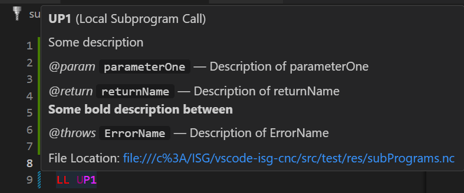

# ISG CNC (vscode-isg-cnc README)

This extension for [Visual Studio Code](https://code.visualstudio.com/) should help you write nc code for the ISG CNC kernel.
We support syntax highlighting, snippets and many more features. The features can be used by pressing F1 in VS-Code and choose the `ISG-CNC:`-command you want to use or select the command in the `ISG commands` list of the right-click menu. \
The extension provide a sidebar which contains all cycle and tool calls in the actual file. \
The keyboard bindings can be changed at the keyboard preferences.\
For keyboard preferences press `CTRL+SHIFT+P` and type keyboard. Select Preferences: Open Keyboard Shortcuts.
Now you can search for isg-cnc to find or change shortcuts.\
After pressing `CTRL+SHIFT+P` you can also type ISG-CNC to find all exported commands for this extension. \
There is also an ISG-Command-Submenue when right-clicking, where you can trigger commands via mouse click. \
You can choose special color themes ISG-CNC Light and Dark by pressing F1 and type theme, select Preferences: Color Theme.
The documentation for ISG-CNC start with or without selection.

You can find and download the extension in the following marketplaces:

- [Microsoft Visual Studio Marketplace](https://marketplace.visualstudio.com/items?itemName=isg-cnc.vscode-isg-cnc)
- [Eclipse Foundation Open VSX Registry](https://open-vsx.org/extension/isg-cnc/vscode-isg-cnc)

## Requirements

Visual Studio Code V1.73.1 or higher

## Manuals

- For more project details look at the project [pages](https://isg-stuttgart.github.io/vscode-isg-cnc/).
- More information about the nc code syntax look at the [ISG documentation](https://www.isg-stuttgart.de/kernel-html5/).
  - Direct link to the [german programming manual](https://www.isg-stuttgart.de/kernel-html5/de-DE/index.html#414992651)
  - Direct link to the [english programming manual](https://www.isg-stuttgart.de/kernel-html5/en-GB/index.html#414992651)

## Feature Listing
  ### Editing
  - Snippets and Hover information for ISG Cycle Calls and their parameters
  - Code completion
  - Code formatting
  - Add and remove blocknumbers
  - Align equal signs in selected range via command
  - Align line comments in selected range via command
  - Region folding (snippets triggered when typing "#region")

  ### Getting information
  - "Go to Definition" for program calls, goto-statements and self-defined variables (last one only rudimentary), use it via "strg+hover+leftclick" or "F12"
  - "Go to References" for program calls, goto-statements and self-defined variables (last one only rudimentary), use it via "shift+F12"
  - .isg-cnc-ignore file to ignore files/directories while searching for references/definitions. Create it by your own or use the "Add to -isg-cnc-ignore"-command on a file/directory. It follows the rules of the .gitignore specification. See https://git-scm.com/docs/gitignore for more information.
  - Syntax highlighting
  - Light and dark color theme for ISG CNC language
  - Find technology like T, F, S commands
  - Show and jump to fileoffset
  - Open documentation in browser
  - Sidebar to show important code fragments (currently: Tool calls and Program calls) of the currently opened NC-file. When clicked, cursor will land at the right file position.
  - Command to jump into a file by selecting it's name or absolute path and an optional offset 
  - Hover information for self-defined calls of subprograms/cycles based on [program-doc-comments](#sub-program-comments)

  ### Additionals
  - Command to change the language mode of a file or whole directory (accessible via right-click menu, not in the ISG Command Submenu)
  - Encrypt files by key

## Feature Details
### Sub Program Comments
You can define doc comments for your subprograms, cycles, Goto-Labels, Goto-Blocknumber, variables like this:
```nc
#COMMENT BEGIN
  Some description
  @param parameterOne - Description of parameterOne
  @return returnName Description of returnName  
  **Some bold description between**
  @throws ErrorName Description of ErrorName
#COMMENT END
%L UP1...
```
The result will look like this: \


Note the following:
- Doc comment must start with `#COMMENT BEGIN` and end with `#COMMENT END`
- Exception: For variables the priority of the doc comment is 1. doc-comment in front of its declaration and 2. a line comment behind it
- Content of the doc comment can be written your similar to [TypeDoc](https://typedoc.org/guides/doccomments/) comments
- Content will be rendered as markdown
- No restriction for used tags but we recommend standardised tags like `@param`, `@return` and `@throws`
- Doc comment for a not explicitly declared main program must be before any non-white-space character in the file
- Comment will be shown in the hover information of according declarations and the corresponding calls (or the GOTO Statement) 
- The `-` between a tag's name and its description is optional and will make no difference in the markdown rendering

## License

See license in [LICENSE](LICENSE)

## Known Issues

Please find and report issues on [git issues](https://github.com/isg-stuttgart/vscode-isg-cnc/issues).

## Release Notes

For release notes see [changlog.md](CHANGELOG.md).

## Testing of the extension
All extension utilities (client + server) are being tested by running mocha tests in
a vscode test instance with [electron](https://www.npmjs.com/package/@vscode/test-electron). \
The tests are located in the [test](src/test/suite) folder being split in client and server tests. \
The vscode test instance uses the [res](src/test/res) directory as workspace root, which contains some nc files for testing. \
If you want to run the tests within vscode, run the "Extension Tests" task in the vscode task menu. This will execute the tests in a new window.\
To run the tests via console, run `npm run test` in the root folder of the extension. 
This is also be done by a github action on pushes and pull requests.
In most cases one typescript source file is tested by one test file with the same name and the suffix `.test.ts`. Only when testing the server top level features like "Go to Definition" one file per feature is used. 


## Trademarks

The license does not grant permission to use the trade names, trademarks, service marks, logos or product names of ISG Industrielle Steuerungstechnik GmbH,
except as required for reasonable and customary use in describing the origin of the work and reproducing the content of any notice file.
All other brand names, product names, or trademarks belong to their respective holders.
ISG is not responsible for typographical or graphical errors that may appear in this document.
